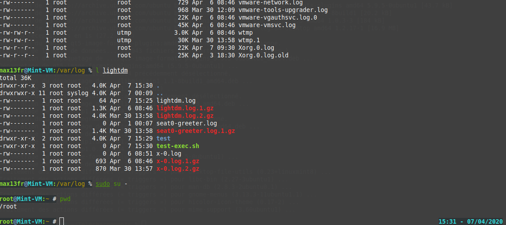

# Introduction
This is my customizations on the Blinks theme that comes with Oh My ZSH. It makes the following changes:

  * Reduce prompt to 1 line instead of 2
  * Replace the history counter on the right side of the prompt with the FR date/time.
  * Adds Mercurial support similar to the git support that the original uses.
  * Display full hostname

# Screenshot

## Usage

### Zgen

<pre>
zgen load max13fr/blinks.zsh-theme blinks.zsh-theme
</pre>

### Antigen

<pre>
antigen update && antigen theme max13fr/blinks.zsh-theme blinks.zsh-theme
</pre>
